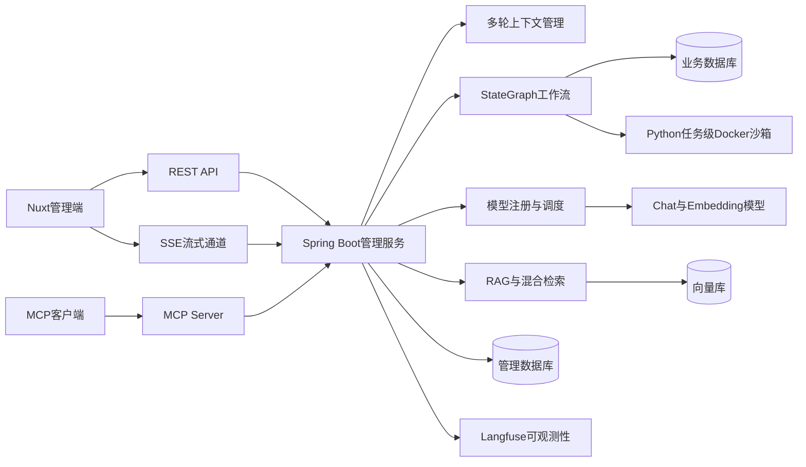
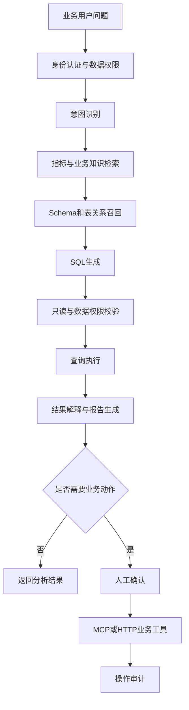

# Enterprise Business Data Agent

企业经营分析与业务协同智能体

> 当前状态：二次开发规划阶段。现阶段可运行能力来自上游 DataAgent

## 项目简介

本项目基于 [Spring AI Alibaba DataAgent](https://github.com/spring-ai-alibaba/DataAgent) 进行学习和二次开发，计划面向销售、库存、采购和应收账款等模拟 ERP 场景，构建自然语言驱动的企业经营分析与业务协同智能体。

项目将沿用上游的 StateGraph、Text-to-SQL、RAG、MCP、SSE 流式响应和 Python 沙箱等基础能力，并重点补充以下企业应用能力：

- ERP 业务数据模型与经营指标口径；
- 部门、角色及区域级数据权限；
- SQL 只读校验、危险语句拦截和数据访问审计；
- 库存预警、应收提醒等 MCP/HTTP 业务工具；
- Human-in-the-loop 高风险操作确认；
- Agent 评测、Token 统计、日志、指标和链路追踪；
- 面向本地开发的一键化容器部署。

本项目使用模拟业务数据，仅用于技术学习、开源二次开发和个人作品展示，与金蝶及其他商业 ERP 厂商无官方关联。

## 与上游项目的关系

| 类别 | 内容 | 当前状态 |
| --- | --- | --- |
| 上游项目 | Spring AI Alibaba DataAgent | 已存在 |
| 上游基础能力 | StateGraph、Text-to-SQL、RAG、多模型、MCP、SSE、Python沙箱和报告生成 | 已存在 |
| 本地部署验证 | MySQL、后端、前端、模型和数据源配置 | 待完成 |
| 本地二次开发 | ERP模型、权限治理、业务工具、可观测性和评测 | 规划中 |

后续将通过 `CHANGELOG.md` 和 `docs/DIFFERENCES.md` 记录相对上游的新增、修改和保留能力，避免把上游成果表述为个人成果。

## 业务目标

企业经营数据通常分散在客户、订单、库存、采购和应收等业务模块中，业务人员查询数据时可能依赖研发人员编写 SQL，同时还面临指标口径不统一和数据越权风险。

本项目计划支持以下典型问题：

- 分析华东区域近三个月销售额和毛利率变化；
- 查询低于安全库存的商品并生成补货建议；
- 找出逾期超过指定天数的应收账款；
- 按客户、地区和商品分析订单与毛利情况；
- 生成月度经营分析报告；
- 在执行补货申请等数据变更操作前请求人工确认。

## 技术架构

### 上游基础架构

上游系统采用前后端分离架构：Nuxt 管理端通过 REST API 和 SSE 与 Spring Boot 服务通信；后端使用 StateGraph 编排意图识别、证据召回、Schema 召回、计划生成、SQL/Python 执行和报告生成节点，并连接业务数据库、管理数据库、向量库、模型服务、MCP 服务和任务级 Python 沙箱。

### 规划中的企业业务扩展

## 核心工作流
